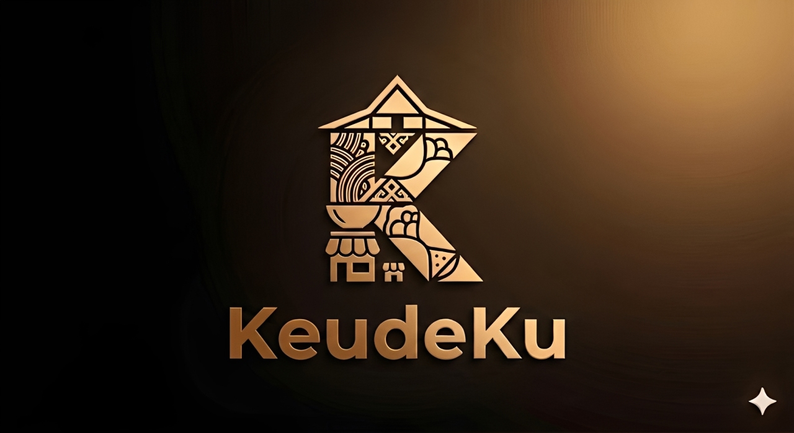
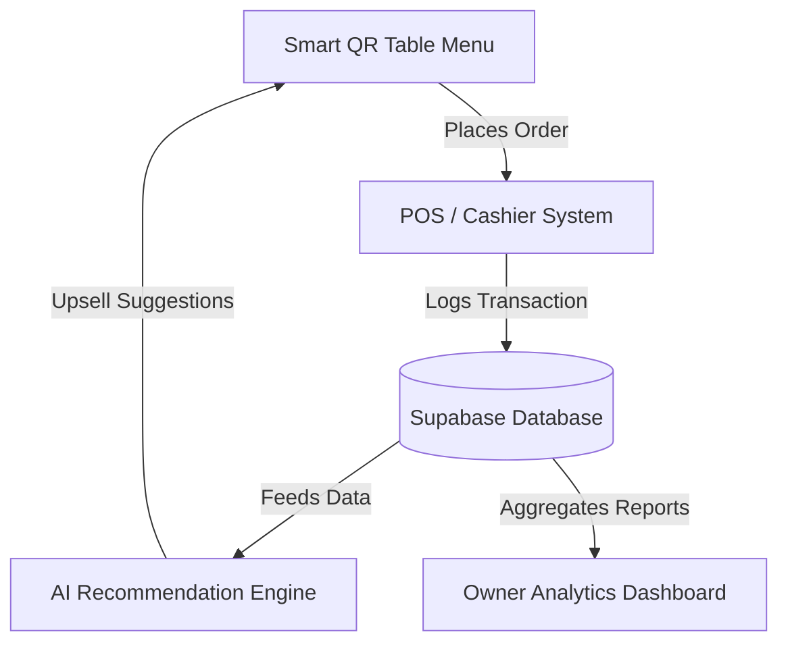

<p align="center">
  
</p>

<h1 align="center">☕ KeudeKu</h1>
<p align="center">
  <strong>The Ultimate F&B Management Ecosystem & Smart QR Menu for Indonesian UMKM</strong>
</p>

<p align="center">
  <a href="https://nextjs.org">
    
  </a>
  <a href="https://supabase.com">
    
  </a>
  <a href="https://typescriptlang.org">
    
  </a>
  <a href="https://tailwindcss.com">
    
  </a>
</p>

---

## 📖 Overview

**KeudeKu** is an all-in-one, premium F&B Management SaaS tailored specifically for Indonesian culinary UMKM (food stalls, cafes, coffee shops, and local restaurants). 

Traditional QR menus only show items. **KeudeKu turns a simple QR Menu into a complete customer engagement, POS, and AI-powered business intelligence ecosystem.**

Designed with a sleek, minimalist **modern tech aesthetic** fused with subtle, elegant **Acehnese cultural motifs** (the iconic *Rumoh Aceh* roofline and *Pinto Aceh* geometry).

---

## ✨ Key Capabilities



### 📱 1. Interactive Customer Experience
*   **Smart QR Table Menu:** Diners scan table-specific QR codes to browse, search, customize, and order instantly.
*   **Personalization & Loyalty:** Automated reward points and digital stamps that keep customers coming back.
*   **AI Recommendations:** Upsells side dishes, desserts, or drink upgrades based on order history and hot trends.

### 💼 2. Operational Mastery
*   **Unified POS & Payments:** Accepts Cash, QRIS, and E-Wallets. Generates professional receipts and handles complex splits.
*   **Kitchen Dispatch Display:** Real-time queue tickets categorized by table and preparation time.
*   **Live Inventory Control:** Low-stock warnings and menu auto-disables to prevent disappointed customers.
*   **Deep Business Analytics:** Visually stunning tracking of revenue, hot items, peak hours, and customer retention.

---

## 🎨 Design System & Visual Palette

KeudeKu uses a luxurious, warm espresso-themed palette that reflects both a premium cafe experience and the deep heritage of Aceh coffee culture.

| Color | Hex | Role | Visual Preview |
|---|---|---|---|
| **Deep Espresso** | `#1A1615` | Dark Background / Contrast | `████████████` |
| **Warm Latte** | `#FDF8F5` | Bright Surface / Minimalist text | `████████████` |
| **Mocha Brown** | `#4A3E3D` | Borders, Accents, and Subtitles | `████████████` |
| **Soft Amber** | `#C9822B` | Highlights, CTA Buttons, and Badges | `████████████` |

*   **Aesthetics:** Modern premium SaaS first, cultural heritage second.
*   **Typography:** Outfit & Inter for high readability and premium clean feel.

---

## 👥 The Dream Team

<table align="center">
  <tr>
    <td align="center" width="25%">
      <br/>
      <strong>Nabil Aditia Putra</strong><br/>
      <code style="color: #C9822B;">HACKER</code>
    </td>
    <td align="center" width="25%">
      <br/>
      <strong>Reza Nurhakim</strong><br/>
      <code style="color: #C9822B;">HACKER</code>
    </td>
    <td align="center" width="25%">
      <br/>
      <strong>M. Fahril Khalifi</strong><br/>
      <code style="color: #C9822B;">HIPSTER</code>
    </td>
    <td align="center" width="25%">
      <br/>
      <strong>Hanif Maulana</strong><br/>
      <code style="color: #C9822B;">HUSTLER</code>
    </td>
  </tr>
  <tr>
    <td align="center">Full‑Stack & DB Architect</td>
    <td align="center">Lead Logic & Security</td>
    <td align="center">UI/UX & Branding Master</td>
    <td align="center">Product Strategy & Pitch</td>
  </tr>
</table>

---

## 🏗️ Architecture & Stack

```
 ┌────────────────────────────────────────────────────────┐
 │                      FRONTEND                          │
 │      Next.js 15 (App Router) + React 19 + Tailwind     │
 └──────────────────────────┬─────────────────────────────┘
                            │ (Secure Auth & Realtime Sub)
                            ▼
 ┌────────────────────────────────────────────────────────┐
 │                      BACKEND                           │
 │     Supabase (PostgreSQL + Auth + Edge Functions)      │
 └──────────────────────────┬─────────────────────────────┘
                            │ (Future API Scaling)
                            ▼
 ┌────────────────────────────────────────────────────────┐
 │                     EXPANSION                          │
 │         Optional microservices via NestJS              │
 └────────────────────────────────────────────────────────┘
```

---

## 🚀 Getting Started

### 1. Requirements
Ensure you have **Node.js v18+** and **npm/pnpm** installed on your system.

### 2. Installation
```bash
# Clone the repository
git clone git@github.com:nightcoders-studio/ach-2.git
cd ach-2

# Install workspace dependencies
npm install
```

### 3. Database Configuration
Copy the sample environment file and configure your Supabase credentials:
```bash
cp .env.example .env.local
```
*Fill in `NEXT_PUBLIC_SUPABASE_URL` and `NEXT_PUBLIC_SUPABASE_ANON_KEY`.*

### 4. Run Development Server
```bash
npm run dev
```
Open **[http://localhost:3000](http://localhost:3000)** in your browser to see the live app.

---

## 📄 License
This project is licensed under the MIT License - see the [LICENSE](LICENSE) file for details.

---
<p align="center">
  <em>Built with ❤️ in Banda Aceh for Indonesian UMKM.</em>
</p>
